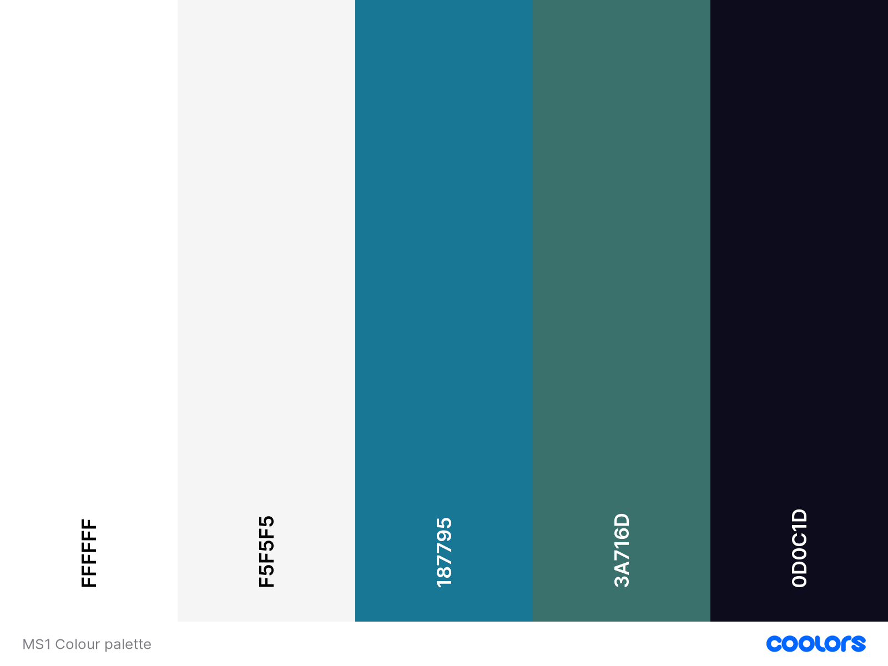

# Routes of Europe
[Link to live website]()

---

## About
**Milestone 1 project - User-Centric Frontend Development - Code institute**

Routes of Europe is a concept for a business that provides route planning services for trips around Europe. 

---

## Table of Contents
- [User experience (UX)]()     
    - [User stories]()
    - [Strategy]()
    - [Scope]()
    - [Structure]()
    - [Skeleton]()
    - [Surface]()
- [Features]()
- [Technologies used]()
- [Testing]()
- [Deployment]()
- [Credits]()

---

## User experience (UX)
Text here 

### User stories
#### As a new user I want ...
- The purpose of the website to be clear.
- To easily navigate the website, to learn more about travelling around Europe.
- To find readily available informaiton about the business and have clear contact options if I want to find out more.

#### As a returning user I want ...
- Inspiring imagery and information to give me ideas for my next trip I will book through the website.
- A website that is easy to use and works well on mobile, tablet, and desktop.

#### As the business owner I want ...
- To increase awareness of the business.
- To increase trip planning requests to allow the business to grow financially.
- To increase the businesses social media presence.

---

### Strategy
The following questions were asked when developing a strategy...
- Who is the target audientce, and is it culturally appropriate?
    - The target audience is anyone who wants to travel Europe, from research 2/3 of backpackers are aged 20-25 years old. 
- Is the technology appropriate for the user and the purpose of the website?
    - The strategy for the technology is simplicity, there is no need for any complex technology for the purpose of this website.
- How is the offering of this site different from competitors?
    - From carrying out a competitor review, most other sites either only provide route ideas and not the ability to book, or they allow you to book set routes and do not have the option to create custom routes to meet individual requests/needs.

Following on from this a list of opportunities were put together. Each opportunity was then rated on a scale of 1-5 in two dimensions.
1. Importance
    - How crucial is it this oppurtunity?
2. Viability/Feasibility
    - How realistic is implementing this opportunity?

| Opportunity | Importance  | Viability/Feasibility | 
| ----------- | ----------- | ----------- |
| Increase booking requests through the form.| 5 | 4 |
| Increase returning users| 5 | 5 |
| Increase members of Routes of Europe Facebook group.| 3 | 5 |
| Gain a larger social media following.| 2 | 3 |
| Develop relationships with travel brands to gain affiliate links.| 3 | 2 |

Insert graph here?

From the above table, the focus for the strategy will be on the following:
- Increase booking requests through the form.
- Increase returning users
- Increase members of Routes of Europe Facebook group.

---

### Scope
The scope of this website is to provide...
- simple and straightforward navigation
- clear and concise content alongisde large imagery
- information about the service the business offers
- links to social media, in paritcular the Routes of Europe Facebook group.
- inspirational route ideas
- testimonials from previous users/customers
- a form to allow users to get in touch to put in a booking request.

---

### Structure
The website is organised by a hierarchical tree structure. This is a standard structure used commonly, and it reduces complexity. This structure can sometimes provide problems in regards to the navigation bar when displayed on mobile devices, however including the burger toggle bar, solves this.

It is made up of 3 pages
- A home page - introducing the business, testimonials from customers and information about connecting with other travellers
- A routes page - three route options to inspire users for their trip
- A get in touch page - information about next steps if a user is interested in using the trip planning service, and a form for them to fill out to provide information about their ideal trip.

Components that are used across each page (and are consistent throughout)
- Navigation bar - convential navigaiton elements displayed horizontally along the top of the page.
- Hero image - eye-catching image with a short caption of text overlayed on top, underneath the navigation bar of each page. There is enough content visible underneath each hero image, to entice the user to scroll down.
- Footer - copyright information, social media links with convential logo icons, and an up arrow with a link to bring you back to the top of the page.

---

### Skeleton

- Each page has a statement hero image and a short heading, beneath this part of the further text on the page is visible to attract the user to keep reading, and scroll down the page
- I considered the responsive layout and how it would be viewed on tablet and mobile devices as well as on desktop. 
- Padding and margins were used throughout to ensure that the content does not appear cluttered.

#### Wireframes
Insert wireframe screenshots here

(Add desktop screenshots then do link to mobile/tablet)

Things that changed from the wireframe to the end result...
- This
- That

---

### Surface

#### Colour

- #FFFFFF - the background colour for individual sections of the website and for some sections of text
- #F5F5F5 - the overall background colour
- #187795 - the form background colour
- #3A716D - the background of the testimonial cards and the background colour for buttons when hovered
- #0D0C1D - the text colour for most of the text throughout the website

I chose these colours as I wanted a clean, minimalistic look, but still with splashes of colour here and there. The reason I went for this was to keep the focus on the text and imagery.

#### Imagery

It was hard to stick to a colour scheme within the imagery as the content of the images was incredibly varied. However I think as my main colour scheme of the website is quite minimal, the varying coloured images work quite well. Each image is clear and of good size, they are responsive for differing sizes of devices.

- Hero images 
    - I chose bold and scenic images for each hero image. The Amalfi coast, Bruges, and Amsterdam. On each I included a black colour overlay to mute it slightly.

- Carousel images
    - For each route option there are three images within the carousel. I tried to choose images that gave a taste of the countries included on the route, that may entice the user into booking a trip.

- Other imagery 
    - I included two further images on the home page, each of these include people, the train featured in both appears similair to try and provide some continuity of theming. 
 
#### Video 

I included a simple video of a view from a train window, on the get in touch page. The video does not add much in regards to content but rather provides aesthetic adding to the theme of travelling Europe by rail.

#### Typography and icons

I used Google fonts for all of the fonts;

- Roboto
    - This was the main text used throughout, applied to the body. This is a easy-read font that fits well into the theming of the website.

- Roboto 'Mono'
    - This was used for the testimonial cards, to differentiate them from the main body of text.

- Roboto-flex
    - This was used for the location names and also for the form.

- Lobster, Special Elite, Skranji
    - These were used for the Route titles, I chose each one to be different and to stand out to add something extra to the route cards.

---

## Features

Responsiveness

Accessibility

Meta data

404 error page

Home page

Routes page

Get in touch page

Future features to consider
- Video
- Map
- Modals

---

## Technologies used

### Languages

### Frameworks, Libraries and Programs

### Additional technologies

---

## Testing 

- HTML validation
- CSS validation
- Manual testing - chrome developer tools - responsiveness
- Tested user stories
- Bugs

---

## Deployment

Text here 

---

## Credits 

Text here

---

