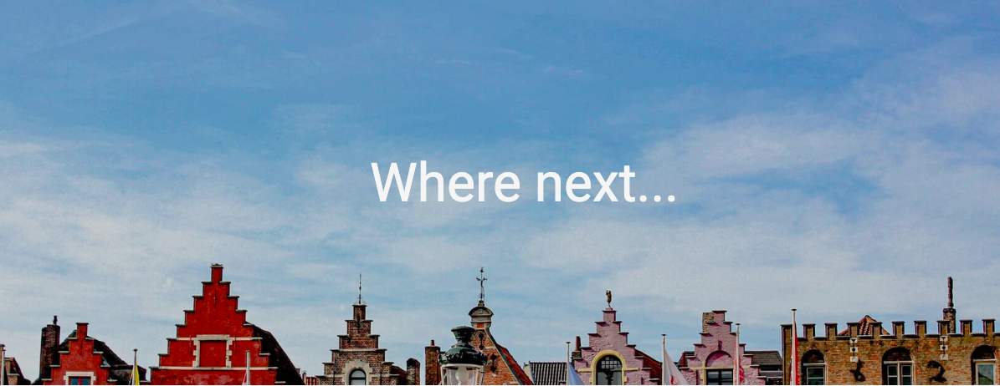
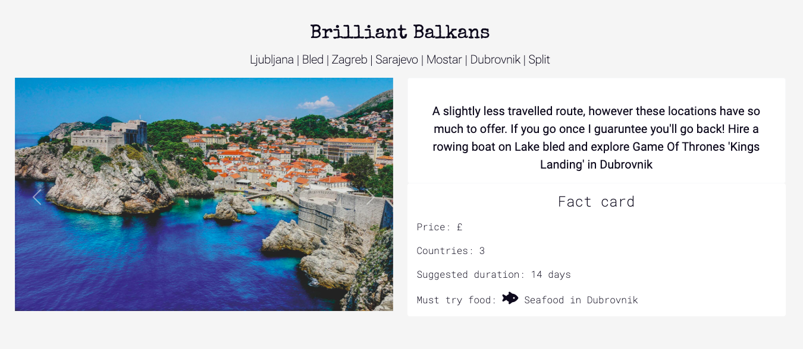
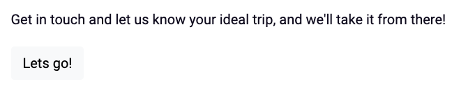
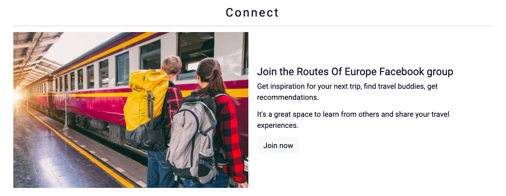

# Testing

## HTML validator
### Home page

- For error 1, I replaced the name attribute with an id attribute.
- For error 2, this was the only way I found in providing textual context to the background image as the image itself was within CSS. I removed this as the image is not providing any information to the user. 
- For error 3 and 4 I changed the buttons to links.

### Routes page

- For error 1, I replaced the name attribute with an id attribute.
- For error 2, this was the only way I found in providing textual context to the background image as the image itself was within CSS. I removed this as the image is not providing any information to the user. 
- For error 3-6, I removed the id attributes as they were not needed, as there was already a class attribute.

### Get in touch page

- For error 1, I replaced the name attribute with an id attribute.
- For error 2, this was the only way I found in providing textual context to the background image as the image itself was within CSS. I removed this as the image is not providing any information to the user. 
- For error 3 and 4 I removed the br elements within the unordered list.

I corrected each error and re-checked the HTML through the validator, and it passed.

## CSS validator
I inputted code into the W3C validation service, initially this brought up two errors
- Text-shadow format was not correct, I decided the text shadow of the text over the hero image was not neccessary so removed that.
- Font weight value was incorrect, I had used 200px instead of 200.
- Once these errors were corrected no further errors were found.

## Performance testing
I utilised the [Lighthouse](https://developer.chrome.com/docs/lighthouse/overview/) performance testing software.
- The results of the lighthouse testing can be seen below for each page. 
- On the first round of testing, the performace was quite low due to image size and bootstrap stylesheets slowing down the first paint of the page.
- I reduced the size of the images and used [Tinypng](https://tinypng.com/) to compress the images. As you can see below, the doing this increased the performance significantly. 
- The accessibility is good although not 100%, this wil be looked into in more detail in the next section.
- The search engine optimisation is good but slightly low due to the link to bring the user back up to the top of the page being unrawlable. 
### Home page

### Routes page

### Get in touch page

## Accessability testing
I utilised [Wave](https://wave.webaim.org/) which is a web accessibility evaluation tool.

- One error was detected, that an empty button was present. This was the collapsable hamburger navbar button, which was adapted from Bootstrap documentation. It works well so I decided to leave it as it is, however will consider that in future projects.
- The contrast ratio was good throughout and passed the tests for normal and large text, apart from the testimonial cards, so I made the background colour darker to increase readability, it then passed the tests.
- The social media links within the footer did not all have titles, this error was corrected.

## Responsiveness
- I utilised Chrome Developer tools to test responsiveness on different devices, the following devices were succesfully tested through this.
    - iPhone SE
    - iPhone XR
    - iPhone 6/7/8
    - Samsung galaxy S8+
    - iPad Air
    - iPad Mini
    - Surface pro 7
    - Galaxy Fold
    - Nest Hub

- I manually tested the website on an iPhone 12 pro, an iPad 2 and a MacBook Air.

## Manual testing

### Functional testing
- A functional navigation bar is present
    - The navigation bar allows users to easily access links to the corresponding pages

- The footer contains a link which allows the user to go back to the top of the page
    - This is present on each page and works as expected

- The social media links open in a new tab
    - This works as expected

- Users can scroll through the carousel or they can watch the slideshow which is automatic
    - The carousels work as expected

- The video does not play automatically and there are controls available to the user
    - The video is paused until the user decides to play it.

- The form does not allow wrong input types to by inputted.
    - An alert will apear when attempting to submit if wrong input type has been used.

- A 404 error page will appear if an incorrect url is entered
    - This works as expected and has a link to go back to home page

### Browser compatibility
The following browsers we used to check compatibility with the website
- Chrome
- Safari
- Microsoft Edge

## Testing User Stories

### As a new user I want ...
- The purpose of the website to be clear.
    - The first section of text underneath the hero image explains what the company is all about

- To easily navigate the website, to learn more about travelling around Europe.
    - Clear navigation bar that links to route page with information about where you can travel in Europe.

- To find readily available informaiton about the business and have clear contact options if I want to find out more.
    - There is a form to get in touch and social media links within the footer

### As a returning user I want ...
- Inspiring imagery and information to give me ideas for my next trip I will book through the website.
    - Hero images are eye catching and the route cards contain short but interesting sections of information alongisde a carousel of images.

- A website that is easy to use and works well on mobile, tablet, and desktop.
    - The website has been fully tested and is responsive on all device sizes.

### As the business owner I want ...
- To increase awareness of the business.
    - Key words have been included within the meta tags to allow for search engine optimisation.
- To increase trip planning requests to allow the business to grow financially.
    - There is an extra link on the home page taking the user directly to the form, to encourage requests.

- To increase the businesses social media presence.
    - There is a dedicated section to the Routes of Europe Facebook group, as well social media links within the footer. 

## Identified bugs

- Bug: On the routes page I noticed that when clicking left or right on the second or third carousel it was controlling the first and not the one that was being clicked.
- How I fixed it: I realised that each carousel had the same id as I had copied and pasted without realising, once this was corrected the error was solved.

- Bug: The text on the get in touch page, explaining the next steps, when viewed on a mobile device was slightly off centre to the right.
- How I fixed it: I changed the text from an unordered list with list items, to individual paragraphs, and this allowed the text to be aligned to the centre.

- Bug: When viewed on smaller screen sizes the carousel images appeared unequal in size.
- How I fixed it: I used an image resizer to make sure images had the same dimensions.